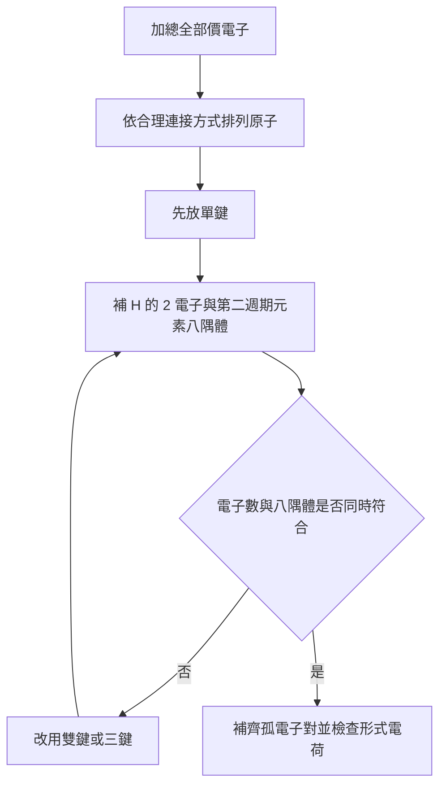
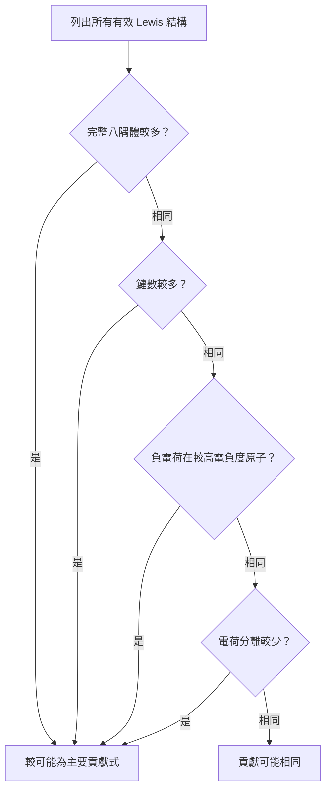
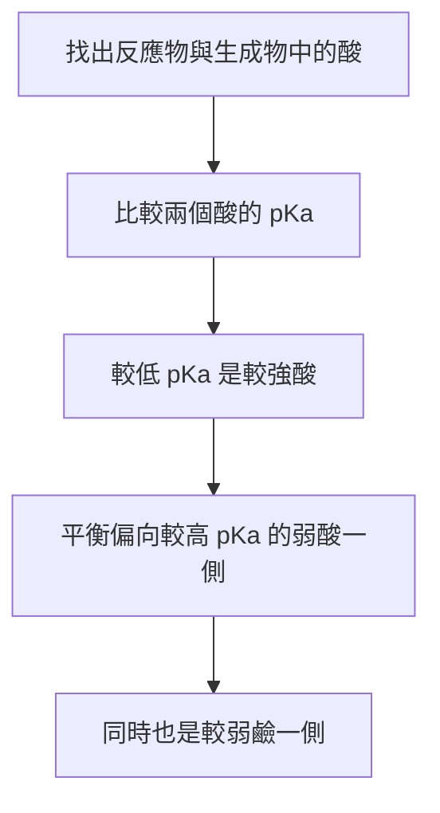
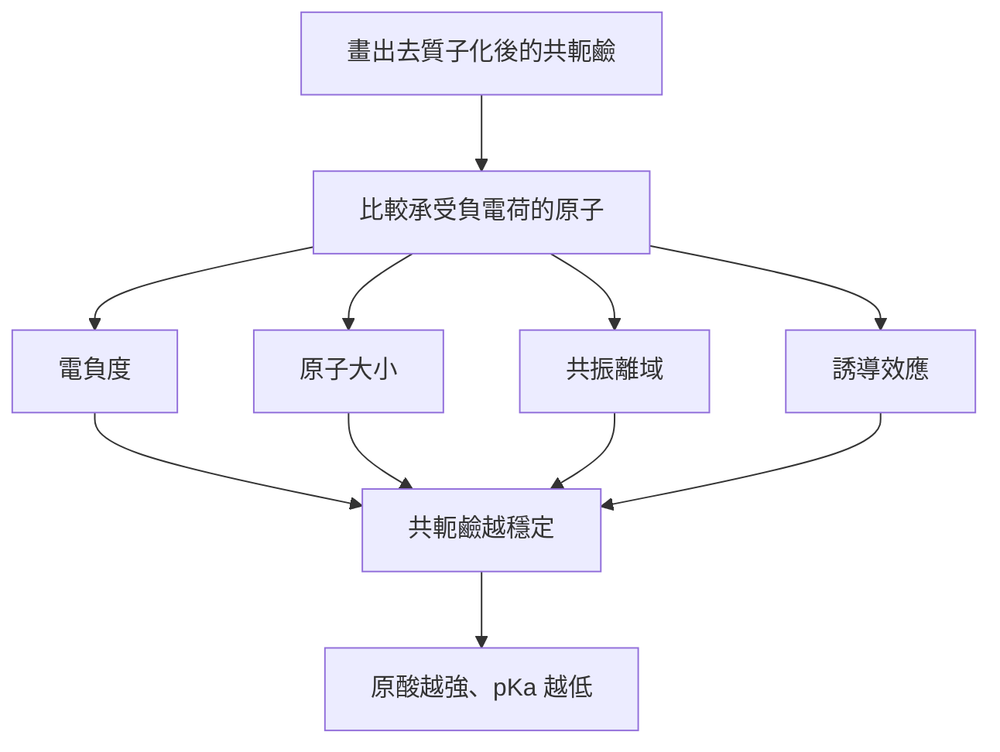
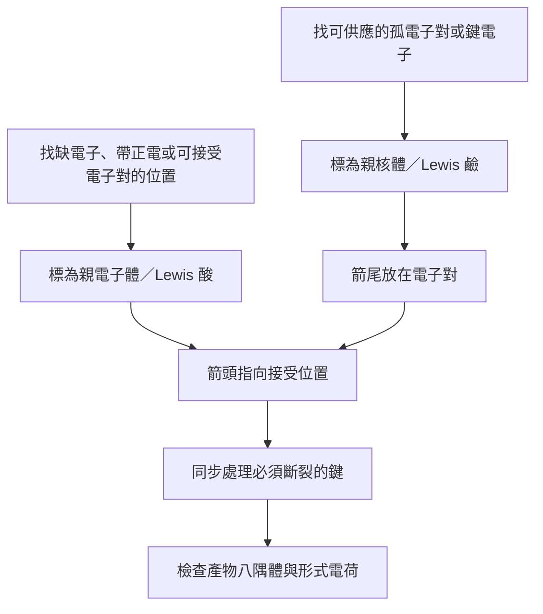

<!-- title: Organic Chemistry -->
<!-- description: 有機化學115-1筆記-->
<!-- category: Study -->
<!-- tags: Chemistry -->
<!-- published time: 2026/9/16 -->

<!-- max collapse heading: ## -->
<!-- number outline: false -->
<!-- dim sources: true -->

# Chapter 1｜Introduction and Review

## §1-1 有機化學的起源

- 有機化學 (organic chemistry) 的現代定義是「碳化合物的化學」。碳能與其他碳原子及多種元素形成強鍵，進而構成鏈狀與環狀分子。
- 舊定義把有機物視為由生物取得的物質，並以生命力論 (vitalism) 認為天然產物需要「生命力」才能形成。
- 1828 年 Wöhler 加熱無機物氰酸銨得到尿素，顯示有機化合物可由無機化合物合成，生命力論因後續合成證據而被拋棄。
- 並非所有含碳化合物都分類為有機物；課本列出鑽石、石墨、二氧化碳、氰酸銨與碳酸鈉等例外。

[§1-1／書 p.1–2／PDF p.1–2]

## §1-2 原子結構與電子組態
### 3.1 原子、原子序與同位素

- 原子由質子、中子與電子組成；質子帶正電、中子不帶電，兩者位於原子核；電子帶負電並分布在原子核周圍。質子與中子的質量相近，約為電子質量的 1800 倍，因此原子的質量幾乎都集中於原子核。
- **原子序 (atomic number)** 等於核內質子數，決定元素種類。
- **質量數 (mass number)** 等於質子數與中子數之和。
- **同位素 (isotopes)** 是質子數相同、中子數不同的原子。課本以 $^{12}\mathrm C$、$^{13}\mathrm C$、$^{14}\mathrm C$ 說明；$^{14}\mathrm C$ 為放射性同位素，半衰期 5730 年。

[§1-2A／書 p.3／PDF p.3]

### 3.2 軌域、電子密度與節點

- **軌域 (orbital)** 是束縛於原子核之電子所允許的能量狀態，並帶有描述空間電子密度分布的機率函數；每個軌域最多容納兩個自旋配對的電子。
- **電子密度 (electron density)** 是在空間某區域找到電子的相對機率。
- 電子殼層以主量子數 $n$ 表示；$n$ 增加時，殼層平均離核更遠、能量更高，也可容納更多電子。第一殼層可容納 2 個電子，第二殼層可容納 8 個電子。
- $1s$ 軌域呈球形對稱，電子密度在原子核處最大，並隨離核距離增加而下降。
- $2s$ 軌域同樣呈球形對稱，但含有一個電子密度為零的球形區域，稱為**節點 (node)**；其主要電子密度比 $1s$ 更遠離原子核，因此能量較高。
- 三個 $2p$ 軌域分別沿 $x,y,z$ 軸方向排列，每個都有通過原子核的**節面 (nodal plane)**，三者能量相同，屬於簡併軌域 (degenerate orbitals)。

[§1-2B；Essential Terms／書 p.3–5、35／PDF p.3–5、35]

> **圖片註記**：建議插入課本書 p.4–5／PDF p.4–5 的 Figure 1-2～1-4，比較 $1s$、$2s$、$2p$ 軌域的電子密度、節點與方向。

### 3.3 第一、第二週期元素電子組態

| 元素 | 電子組態 | 價電子數 |
|---|---|---:|
| H | $1s^1$ | 1 |
| He | $1s^2$ | 2 |
| Li | $1s^22s^1$ | 1 |
| Be | $1s^22s^2$ | 2 |
| B | $1s^22s^22p_x^1$ | 3 |
| C | $1s^22s^22p_x^12p_y^1$ | 4 |
| N | $1s^22s^22p_x^12p_y^12p_z^1$ | 5 |
| O | $1s^22s^22p_x^22p_y^12p_z^1$ | 6 |
| F | $1s^22s^22p_x^22p_y^22p_z^1$ | 7 |
| Ne | $1s^22s^22p_x^22p_y^22p_z^2$ | 8 |

[Table 1-1／書 p.6／PDF p.6]

- **價電子 (valence electrons)** 是最外層殼層中的電子；對課本 Figure 1-5 所列主族元素，族號對應價電子數。
- **Hund’s rule**：當兩個以上同能量軌域尚未填滿時，最低能量的電子組態會先讓電子分占不同軌域且自旋平行，而不是先在同一軌域配對。

[§1-2C；Essential Terms／書 p.5–6、35／PDF p.5–6、35]

## §1-3～§1-5 八隅體、Lewis 結構與多重鍵
### 4.1 八隅體規則

- **八隅體規則 (octet rule)**：原子傾向藉由電子轉移或共享，取得填滿的價電子殼層，也就是惰性氣體電子組態；第二週期元素的填滿價殼層具有 8 個電子。
- 氫的填滿價殼層只有 2 個電子；題目所稱「所有八隅體滿足」是指第二週期元素達到八隅體，而氫達到 2 電子。
- 第三週期及更高週期的元素可有超過 8 個電子的擴大八隅體；第二週期的 B、C、N、O、F 不可超過 8 個價電子。

[§1-3；§1-9／書 p.6–7、15／PDF p.6–7、15]

### 4.2 離子鍵與共價鍵

| 類型 | 電子行為 | 結果 | 本章重點 |
|---|---|---|---|
| 離子鍵 (ionic bonding) | 電子由一原子轉移至另一原子 | 相反電荷離子互相吸引，常形成大型晶格 | 有機物中較少見 [§1-3A／書 p.7／PDF p.7] |
| 共價鍵 (covalent bonding) | 原子共享電子 | 電子集中於兩核之間形成鍵 | 有機化合物最常見 [§1-3B／書 p.7／PDF p.7] |

### 4.3 Lewis 結構

- Lewis 結構用點表示價電子；一對成鍵電子可用一對點或一條線表示，非鍵結電子仍以點表示。
- **非鍵結電子 (nonbonding electrons)** 是未被兩個原子共享的價電子；一對非鍵結電子稱為**孤電子對 (lone pair)**。
- 完整 Lewis 結構應畫出孤電子對。課本提醒，有機化學中常省略部分孤電子對，但這些簡化畫法不是完整 Lewis 結構，判斷反應性時仍必須想出正確的孤電子對數。

[§1-4／書 p.7–8／PDF p.7–8]

### 4.4 單鍵、雙鍵、三鍵與常見價數

- 單鍵、雙鍵、三鍵分別共享 1、2、3 對電子。
- **價數 (valence)** 是一個原子通常形成的鍵數。

[§1-5／書 p.8–9／PDF p.8–9]

| 中性原子 | 常見鍵數 | 常見孤電子對數 |
|---|---:|---:|
| C | 4 | 0 |
| N | 3 | 1 |
| O | 2 | 2 |
| H | 1 | 0 |
| 鹵素 | 1 | 3 |

[Summary: Common Bonding Patterns (Uncharged)／書 p.9／PDF p.9]

> **圖片註記**：建議插入課本書 p.9／PDF p.9 的「Common Bonding Patterns (Uncharged)」摘要表。

### 4.5 Lewis 結構作答流程

[§1-4–1-5；Problems 1-2–1-4／書 p.7–9／PDF p.7–9]

**檢查重點**：總電子數必須正確；陽離子要扣除電子、陰離子要增加電子；H 只能形成一鍵；第二週期元素不得超過八隅體。[§1-4；§1-7；§1-9／書 p.7–8、11–12、15／PDF p.7–8、11–12、15]

## §1-6 電負度、鍵極性與偶極矩
### 5.1 極性判斷

- 兩原子平均共享電子時形成**非極性共價鍵 (nonpolar covalent bond)**；不平均共享時形成**極性共價鍵 (polar covalent bond)**。
- **電負度 (electronegativity)** 表示元素吸引成鍵電子的能力；異核鍵中，電負度較大的原子位於偶極的負端。
- 鍵偶極箭頭的箭頭指向負端，正端以加號標示；部分正、負電荷分別寫成 $\delta^+$、$\delta^-$。
- 課本把 C–H 鍵視為非極性，因為 H 與 C 的電負度相近。

[§1-6／書 p.10／PDF p.10]

### 5.2 偶極矩

$$
\mu=\delta\times d
$$

$\mu$ 是偶極矩，$\delta$ 是電荷分離量，$d$ 是鍵長；課本本章未列偶極矩單位。[§1-6／書 p.10／PDF p.10]

### 5.3 本章列出的 Pauling 電負度

| 元素 | H | Li | Be | B | C | N | O | F |
|---|---:|---:|---:|---:|---:|---:|---:|---:|
| 電負度 | 2.2 | 1.0 | 1.6 | 2.0 | 2.5 | 3.0 | 3.4 | 4.0 |

| 元素 | Na | Mg | Al | Si | P | S | Cl | K | Br | I |
|---|---:|---:|---:|---:|---:|---:|---:|---:|---:|---:|
| 電負度 | 0.9 | 1.3 | 1.6 | 1.9 | 2.2 | 2.6 | 3.2 | 0.8 | 3.0 | 2.7 |

[Figure 1-7／書 p.10／PDF p.10]

> **圖片註記**：建議插入課本書 p.10／PDF p.10 的 Figure 1-6（氯甲烷偶極與 EPM）及 Figure 1-7（Pauling 電負度）。

## §1-7～§1-8 形式電荷與離子結構
### 6.1 形式電荷公式

形式電荷 (formal charge, FC) 是追蹤 Lewis 結構中電子分配的方法；它可能不等於實際電荷，但通常能指出帶有主要電荷的原子。[§1-7／書 p.11／PDF p.11]

$$
\mathrm{FC}
=[\text{group number}]
-[\text{nonbonding electrons}]
-\frac12[\text{shared electrons}]
$$

[§1-7／書 p.11／PDF p.11]

也就是：原子分得全部非鍵結電子，以及每一對成鍵電子中的一個電子，再與中性自由原子的價電子數比較。[§1-7／書 p.11／PDF p.11]

### 6.2 常見成鍵與電荷型態

| 原子 | 正電常見型態 | 中性常見型態 | 負電常見型態 |
|---|---|---|---|
| B | 課本摘要表未列 | 3 鍵、無完整八隅體 | 4 鍵 |
| C | 3 鍵、無完整八隅體 | 4 鍵 | 3 鍵＋1 對孤電子 |
| N | 4 鍵 | 3 鍵＋1 對孤電子 | 2 鍵＋2 對孤電子 |
| O | 3 鍵＋1 對孤電子 | 2 鍵＋2 對孤電子 | 1 鍵＋3 對孤電子 |
| 鹵素 | 2 鍵＋2 對孤電子 | 1 鍵＋3 對孤電子 | 0 鍵＋4 對孤電子 |

[Summary: Common Bonding Patterns in Organic Compounds and Ions／書 p.13／PDF p.13]

> **圖片註記（重要）**：建議直接插入課本書 p.13／PDF p.13 的完整「Common Bonding Patterns in Organic Compounds and Ions」表；這張表是本章最重要的結構辨認表之一。

### 6.3 形式電荷代表例

1. **甲烷** $CH_4$：C 有 4 鍵且無孤電子，$\mathrm{FC}=4-0-4=0$；每個 H 為 $1-0-1=0$。[Solved Problem 1-1(a)／書 p.11／PDF p.11]
2. **水合氫離子** $H_3O^+$：O 有 3 鍵、1 對孤電子，$\mathrm{FC}=6-2-3=+1$；H 均為 0。[Solved Problem 1-1(b)／書 p.11–12／PDF p.11–12]
3. $H_3N-BH_3$：N 與 B 都有 4 鍵；N 的 $\mathrm{FC}=5-0-4=+1$，B 的 $\mathrm{FC}=3-0-4=-1$，整體仍為中性。[Solved Problem 1-1(c)／書 p.12／PDF p.12]
4. $[H_2CNH_2]^+$：正電荷可在不同 Lewis 結構中位於 N 或 C，這兩個畫法的意義在共振章節處理。[Solved Problem 1-1(d)／書 p.12／PDF p.12]

### 6.4 離子結構判斷

- 甲基銨氯化物應畫成 $CH_3NH_3^+$ 與 $Cl^-$；若把 Cl 以共價鍵接在 N 上，N 會有 5 鍵、10 個價電子，違反第二週期元素的八隅體限制。
- 電負度差很大、約 2 或以上的原子間鍵結通常畫成離子式；課本以 sodium acetate 說明 Na–O 優先畫成 $Na^+$ 與有機陰離子。

[§1-8／書 p.13／PDF p.13]

## §1-9 共振
### 7.1 共振的意義

- 當同一化合物可畫出兩個以上只在**電子位置**不同的有效 Lewis 結構時，這些畫法稱為共振式 (resonance forms／resonance structures)，實際分子是共振混成體 (resonance hybrid)。
- 個別共振式不是可分離、來回互換的分子；電子同時離域於整個共振混成體。
- 共振式之間使用單一雙頭箭頭；化學平衡則使用一對方向相反的箭頭，兩者不可混淆。
- 電荷若由兩個以上原子共同承擔，稱為離域電荷 (delocalized charge)；電荷離域會形成共振穩定。

[§1-9A／書 p.14–15／PDF p.14–15]

> **圖片註記**：建議插入課本書 p.14／PDF p.14 的 acetate ion 共振式與共振混成表示法，以及書 p.15／PDF p.15 的 nitromethane 共振式。

### 7.2 畫共振式的硬性規則

1. 每一個共振式都必須是該化合物的有效 Lewis 結構。
2. 只能移動電子，尤其是雙鍵電子與孤電子對；原子核不可移動，鍵角亦須保持相同。
3. 未成對電子的數目必須保持相同；穩定化合物通常沒有未成對電子。
4. 主要貢獻式是能量最低的結構；良好貢獻式通常具有最多完整八隅體、最多鍵、最少電荷分離，且負電荷位於較高電負度的原子。
5. 共振在能把電荷離域至兩個以上原子時特別重要。

[§1-9B／書 p.16／PDF p.16]

### 7.3 主、次貢獻式判斷順位

[Problem-solving Hint；§1-9B／書 p.16／PDF p.16]

### 7.4 代表判斷

- $[CH_3OCH_2]^+$：讓 O 形成 3 鍵並使所有原子達八隅體的結構為主要貢獻式；正電 C 只有 6 電子的結構為次要貢獻式。[Solved Problem 1-2(a)／書 p.16／PDF p.16]
- 含 C 與 O 的負離子例：若兩式都有完整八隅體且鍵數相同，負電荷位於較高電負度 O 的結構為主要貢獻式。[Solved Problem 1-2(b)／書 p.17／PDF p.17]
- $H_2SO_4$ 的 S 是第三週期元素，可畫擴大價殼層；但課本指出理論計算可能使所有原子皆滿足八隅體的高電荷分離式成為主要式，因此有些系統不能只靠簡單規則可靠預測。[Solved Problem 1-2(c)／書 p.17／PDF p.17]

### 7.5 共振常見錯誤

- 移動原子或改變碳骨架：這會變成不同化合物，不是共振式。[§1-9B／書 p.16／PDF p.16]
- 讓第二週期元素超過 8 電子：不是有效 Lewis 結構。[§1-9A／書 p.15／PDF p.15]
- 把共振箭頭畫成平衡箭頭，或宣稱電子在各式間來回振盪。[§1-9A／書 p.14–15／PDF p.14–15]
- 只看形式電荷而忽略八隅體：比較貢獻度時，完整八隅體是課本提示中的第一順位。[§1-9B／書 p.16／PDF p.16]

## §1-10 結構式
### 8.1 三種表示方式

| 表示法 | 顯示內容 | 省略內容 | 出處 |
|---|---|---|---|
| 完整 Lewis 結構 | 所有原子、鍵與價電子 | 不省略 | [§1-10／書 p.18／PDF p.18] |
| 縮合結構式 (condensed structural formula) | 每個中心原子及與其相連的原子；相同基團可用括號與下標 | 個別鍵、通常也省略孤電子對 | [§1-10A／書 p.18–19／PDF p.18–19] |
| 線角式 (line–angle formula) | 用線表示鍵；線端與轉折點代表 C | C 標號、連在 C 上的 H、通常也省略孤電子對 | [§1-10B／書 p.20／PDF p.20] |

### 8.2 縮合結構式規則

- 與同一中心原子相連的原子通常寫在該中心原子後方；兩個以上相同基團可用括號與下標表示，例如 $(CH_3)_3CH$、$CH_3(CH_2)_4CH_3$、$(CH_3CH_2)_2O$。[Table 1-2／書 p.18–19／PDF p.18–19]
- 多重鍵可直接畫出；$-CHO$ 與 $-COOH$ 的實際鍵結方式和字面排列不同，縮合式仍假設遵守八隅體規則。[§1-10A；Table 1-3／書 p.19／PDF p.19]
- 同一結構可有多種合理縮合寫法，例如 acetic acid 可寫成 $CH_3COOH$、$CH_3C(O)OH$ 或 $CH_3CO_2H$ 所代表的課本格式。[Table 1-3／書 p.19／PDF p.19]

### 8.3 線角式規則

1. 每條線的端點與每個轉折點，若未標其他元素，就代表一個 C。
2. N、O、鹵素等非 C、H 原子必須寫出。
3. 接在 C 上的 H 不畫，依 C 總鍵數為 4 自動補足。
4. 接在已寫出的雜原子上的 H 必須畫出。
5. 雙鍵與三鍵照實畫出，孤電子對通常省略。

[§1-10B／書 p.20／PDF p.20]

> **圖片註記（重要）**：建議插入課本書 p.20／PDF p.20 的 Table 1-4，至少保留 hexane、hex-2-ene、hexan-3-ol、cyclohex-2-en-1-one 與 nicotinic acid 的縮合式／線角式對照。

### 8.4 線角式轉換檢查

- 先數線端與轉折點得到 C 數。
- 對每個 C 計算已畫出的鍵級總和，再補 H 使總鍵數為 4。
- 雜原子直接保留，並按常見價數檢查其 H、孤電子對與電荷。
- 最後重新統計分子式，確認轉換前後原子數一致。

[§1-5；§1-10B；Problems 1-9–1-11／書 p.9、20–21／PDF p.9、20–21]

## §1-11 分子式與實驗式
### 9.1 定義

- **分子式 (molecular formula)** 表示一個分子中各元素的實際原子數，但不提供結構資訊。
- **實驗式 (empirical formula)** 只表示不同元素原子數的最簡比例，同樣不提供結構資訊。

[§1-11；Essential Terms／書 p.21、35／PDF p.21、35]

### 9.2 由元素分析求實驗式

1. 假設樣品為 100 g，因此各元素的百分比數值可直接視為克數。
2. 各元素克數除以原子量，得到莫耳數。
3. 全部莫耳數除以其中最小值，得到可辨識的整數比。
4. 由整數比寫出實驗式。

[§1-11／書 p.21／PDF p.21]

若元素分析總和不足 100%，課本題目提示把缺少的百分比視為氧。[Problem-solving Hint／書 p.22／PDF p.22]

### 9.3 由實驗式求分子式

- 先算一個實驗式單位的式量，再用已知分子量判斷應乘的整數倍數。
- 課本例：40.0% C、6.67% H、53.3% O 得到莫耳比 $1:2:1$，實驗式為 $CH_2O$；若分子量約 60，而 $CH_2O$ 的式量為 30，分子式即為 $C_2H_4O_2$。

[§1-11／書 p.21–22／PDF p.21–22]

[§1-11／書 p.21–22／PDF p.21–22]

## §1-12 Arrhenius 酸鹼與 pH
### 10.1 定義與限制

- Arrhenius 酸是在水中解離產生 $H_3O^+$ 的物質；Arrhenius 鹼是在水中解離產生 $^-OH$ 的物質。
- 強酸或強鹼被假設比弱酸或微溶鹼解離得更完全。
- Arrhenius 定義不能說明沒有 $^-OH$ 的 $NH_3$ 為何能中和酸，因此課本接著採用較廣的 Brønsted–Lowry 定義。

[§1-12／書 p.22–23／PDF p.22–23]

### 10.2 水的離子積與 pH

$$
K_w=[H_3O^+][^-OH]=1.00\times10^{-14}\ \mathrm{M^2}
\qquad (25^\circ\mathrm C)
$$

$$
[H_3O^+]=[^-OH]=1.00\times10^{-7}\ \mathrm M
\qquad \text{中性溶液}
$$

$$
\mathrm{pH}=-\log_{10}[H_3O^+]
$$

[§1-12／書 p.23／PDF p.23]

| 溶液 | $[H_3O^+]$ | $[^-OH]$ | pH |
|---|---|---|---|
| 酸性 | $>10^{-7}\ \mathrm M$ | $<10^{-7}\ \mathrm M$ | $<7$ |
| 中性 | $10^{-7}\ \mathrm M$ | $10^{-7}\ \mathrm M$ | $=7$ |
| 鹼性 | $<10^{-7}\ \mathrm M$ | $>10^{-7}\ \mathrm M$ | $>7$ |

[§1-12／書 p.23／PDF p.23]

## §1-13 Brønsted–Lowry 酸鹼
### 11.1 質子轉移與共軛酸鹼對

- Brønsted–Lowry 酸是質子提供者，Brønsted–Lowry 鹼是質子接受者。
- 鹼接受質子後成為能把質子還回去的**共軛酸 (conjugate acid)**；酸失去質子後成為能再接受質子的**共軛鹼 (conjugate base)**。
- 共軛酸鹼對只相差一個質子；例如 $NH_4^+/NH_3$。
- 水等物種可依反應對象充當酸或鹼。

[§1-13／書 p.23–25／PDF p.23–25]

### 11.2 酸解離常數

$$
HA+H_2O\rightleftharpoons H_3O^++A^-
$$

$$
K_a=\frac{[H_3O^+][A^-]}{[HA]}
$$

$$
\mathrm{p}K_a=-\log_{10}K_a
$$

[§1-13A／書 p.24–25／PDF p.24–25]

- 酸越強，水中解離程度越大，$K_a$ 越大而 $\mathrm{p}K_a$ 越小。
- 課本指出強酸的 $\mathrm{p}K_a$ 常接近 0 或為負值，多數有機酸為弱酸且 $\mathrm{p}K_a>4$。

[§1-13A／書 p.24–25／PDF p.24–25]

### 11.3 鹼解離常數與共軛關係

$$
A^-+H_2O\rightleftharpoons HA+^-OH
$$

$$
K_b=\frac{[HA][^-OH]}{[A^-]}
\qquad
\mathrm{p}K_b=-\log_{10}K_b
$$

$$
K_aK_b=10^{-14}
$$

$$
\mathrm{p}K_a+\mathrm{p}K_b=14
$$

[§1-13B／書 p.26–27／PDF p.26–27]

- 酸越強，其共軛鹼越弱；酸越弱，其共軛鹼越強。[§1-13B／書 p.27／PDF p.27]
- 酸鹼反應的平衡通常偏向較弱的酸與較弱的鹼。[§1-13B／書 p.26–27／PDF p.26–27]
- 課本提示：酸會把質子交給較弱酸的共軛鹼；此處「較弱酸」具有較小的 $K_a$ 或較高的 $\mathrm{p}K_a$，因此反應由較強酸／較強鹼的一側朝較弱酸／較弱鹼的一側進行。[Problem-solving Hint；Problem 1-15／書 p.27／PDF p.27]

### 11.4 本章常用酸性表

| 酸 | 共軛鹼 | $K_a$ | $\mathrm{p}K_a$ |
|---|---|---:|---:|
| HCl | $Cl^-$ | $1\times10^7$ | $-7$ |
| $H_3O^+$ | $H_2O$ | $55.6$ | $-1.7$ |
| HF | $F^-$ | $6.8\times10^{-4}$ | $3.17$ |
| HCOOH | $HCOO^-$ | $1.7\times10^{-4}$ | $3.76$ |
| $CH_3COOH$ | $CH_3COO^-$ | $1.8\times10^{-5}$ | $4.74$ |
| HCN | $CN^-$ | $6.0\times10^{-10}$ | $9.22$ |
| $NH_4^+$ | $NH_3$ | $5.8\times10^{-10}$ | $9.24$ |
| $H_2O$ | $HO^-$ | $1.8\times10^{-16}$ | $15.7$ |
| $CH_3CH_2OH$ | $CH_3CH_2O^-$ | $1.3\times10^{-16}$ | $15.9$ |
| $NH_3$ | $NH_2^-$ | $10^{-33}$ | $33$ |
| $CH_4$ | $CH_3^-$ | $10^{-40}$ | $40$ |

[Table 1-5／書 p.26／PDF p.26]

> **圖片註記（重要）**：建議插入課本書 p.26／PDF p.26 的 Table 1-5；表中由上到下酸性變弱、共軛鹼鹼性變強。

### 11.5 預測酸鹼平衡方向

[§1-13B；Problem 1-15／書 p.26–27／PDF p.26–27]

課本例：formic acid 的 $\mathrm{p}K_a=3.76$，HCN 的 $\mathrm{p}K_a=9.22$；formic acid 與 $CN^-$ 反應時，生成較弱酸 HCN 與較弱鹼 formate，因此平衡偏向生成物。[Problem 1-15／書 p.27／PDF p.27]

### 11.6 由結構比較酸性

判斷 Brønsted–Lowry 酸 $HA$ 強弱時，先移除 $H^+$ 畫出共軛鹼 $A^-$，再比較共軛鹼穩定性；共軛鹼越穩定，原酸越強。[§1-13C／書 p.29／PDF p.29]

[§1-13C／書 p.29–30／PDF p.29–30]

#### A. 電負度

同一週期中，較高電負度的元素較能承受負電荷，因此共軛鹼較穩定、原酸較強。課本排列為：

$$
CH_4<NH_3<H_2O<HF
\qquad \text{酸性增加}
$$

其共軛鹼鹼性方向相反：

$$
CH_3^->NH_2^->HO^->F^-
\qquad \text{鹼性由強至弱}
$$

[§1-13C／書 p.29／PDF p.29]

#### B. 原子大小

同族元素向下原子變大，負電荷可分散於較大空間，因此共軛鹼較穩定、原酸較強：

$$
HF<HCl<HBr<HI
\qquad \text{酸性增加}
$$

[§1-13C／書 p.29／PDF p.29]

#### C. 共振穩定

- ethoxide 的負電荷局限在一個 O；acetate 分散在兩個 O；methanesulfonate 分散在三個 O。
- 對應酸的 $\mathrm{p}K_a$：ethanol 15.9、acetic acid 4.74、methanesulfonic acid $-1.2$；電荷離域越充分，共軛鹼越穩定，原酸越強。

[§1-13C／書 p.29–30／PDF p.29–30]

#### D. 誘導效應

- 吸電子原子或基團可經分子的 $\sigma$ 鍵穩定共軛鹼；穩定程度越大，酸性越強、$\mathrm{p}K_a$ 越低。
- 誘導效應會隨吸電子基團與負電荷位置之間的鍵數增加而減弱。butanoic acid、4-chloro、3-chloro、2-chlorobutanoic acid 的 $\mathrm{p}K_a$ 依序為 4.82、4.52、4.05、2.86。
- 吸電子能力更強或吸電子基團更多，酸性更強。課本數值：chloroacetic acid 2.86、fluoroacetic acid 2.59、dichloroacetic acid 1.26、trichloroacetic acid 0.64。

[§1-13C／書 p.30／PDF p.30]

> **圖片註記**：建議插入課本書 p.29–30／PDF p.29–30 的 acidity／stability／basicity 排列圖，以及 p.30 的共振與誘導效應比較圖。

## §1-14 Lewis 酸鹼、親核體與親電子體
### 12.1 定義對照

| 理論 | 酸 | 鹼 | 核心事件 |
|---|---|---|---|
| Arrhenius | 水中產生 $H_3O^+$ | 水中產生 $^-OH$ | 水溶液解離 [§1-12／書 p.22–23／PDF p.22–23] |
| Brønsted–Lowry | 質子提供者 | 質子接受者 | 質子轉移 [§1-13／書 p.23／PDF p.23] |
| Lewis | 電子對接受者 | 電子對提供者 | 形成或斷裂鍵 [§1-14／書 p.31／PDF p.31] |

- Lewis 酸也稱**親電子體 (electrophile)**；Lewis 鹼也稱**親核體 (nucleophile)**。
- 常見 Brønsted–Lowry 酸鹼也屬於 Lewis 酸鹼，其中酸性質子是電子對接受者。
- 有機化學中，「acid／base」通常指質子提供者／接受者；若電子對與其他元素、尤其 C 形成鍵，常使用 nucleophile／electrophile。

[§1-14／書 p.31／PDF p.31]

### 12.2 曲箭頭規則

1. 曲箭頭表示**電子的移動**，不是原子的移動。
2. 箭尾必須從一對電子開始：孤電子對或某一條鍵。
3. 箭頭指向該電子對在產物中的位置：形成新鍵，或成為某原子的孤電子對。
4. 每一對參與成鍵或斷鍵的電子都要有自己的箭頭。
5. 共振式中曲箭頭只是協助追蹤不同畫法；電子不是真的在共振式間流動。

[§1-14／書 p.32–33／PDF p.32–33]

### 12.3 判斷流程

[§1-14；Problem 1-19／書 p.31–33／PDF p.31–33]

### 12.4 同一分子可扮演不同角色

- acetaldehyde 與 HCl 反應時，以羰基 O 的電子對接受質子，acetaldehyde 是鹼／親核體，HCl 是酸；產物正電荷可在 O 與 C 間離域，完整八隅體的 O 帶正電式為主要貢獻式。[Problem 1-19(a)／書 p.32–33／PDF p.32–33]
- acetaldehyde 與 $CH_3O^-$ 反應時，羰基 C 接受電子對，因此 acetaldehyde 是親電子體，$CH_3O^-$ 是親核體。[Problem 1-19(b)／書 p.33／PDF p.33]
- 因反應對象不同，同一有機分子可能表現為酸、鹼、親核體或親電子體。[Problem 1-19／書 p.33／PDF p.33]

> **圖片註記（重要）**：建議插入課本書 p.31–32／PDF p.31–32 的 $NH_3+BF_3$ EPM 與 $CH_3O^-+CH_3Cl$ 曲箭頭示例；再插入書 p.33／PDF p.33 的 acetaldehyde 兩種角色比較。

## 核心公式總表

<!-- table: scroll -->
| 主題 | 公式 | 符號／適用範圍 | 出處 |
|---|---|---|---|
| 偶極矩 | $\mu=\delta d$ | $\delta$：電荷分離量；$d$：鍵長；本章未列單位 | [§1-6／書 p.10／PDF p.10] |
| 形式電荷 | $\mathrm{FC}=\text{族號}-\text{非鍵結電子}-\frac12(\text{共享電子})$ | 對 Lewis 結構中的單一原子計算 | [§1-7／書 p.11／PDF p.11] |
| 水離子積 | $K_w=[H_3O^+][^-OH]=1.00\times10^{-14}\ \mathrm{M^2}$ | $25^\circ\mathrm C$ | [§1-12／書 p.23／PDF p.23] |
| pH | $\mathrm{pH}=-\log_{10}[H_3O^+]$ | 水溶液酸鹼性 | [§1-12／書 p.23／PDF p.23] |
| 酸解離常數 | $K_a=[H_3O^+][A^-]/[HA]$ | $HA+H_2O\rightleftharpoons H_3O^++A^-$ | [§1-13A／書 p.24／PDF p.24] |
| $\mathrm{p}K_a$ | $\mathrm{p}K_a=-\log_{10}K_a$ | $K_a$ 越大，$\mathrm{p}K_a$ 越小 | [§1-13A／書 p.25／PDF p.25] |
| 鹼解離常數 | $K_b=[HA][^-OH]/[A^-]$ | $A^-+H_2O\rightleftharpoons HA+^-OH$ | [§1-13B／書 p.26／PDF p.26] |
| $\mathrm{p}K_b$ | $\mathrm{p}K_b=-\log_{10}K_b$ | 鹼解離常數的對數形式 | [§1-13B／書 p.26／PDF p.26] |
| 共軛酸鹼 | $K_aK_b=10^{-14}$ | 同一共軛酸鹼對、水溶液條件 | [§1-13B／書 p.27／PDF p.27] |
| 對數關係 | $\mathrm{p}K_a+\mathrm{p}K_b=14$ | 由上一式取負對數 | [§1-13B／書 p.27／PDF p.27] |

---

## 代表例題解析
### 例 1｜形式電荷：$H_3O^+$

**題目要點**：計算每個原子的形式電荷。[Solved Problem 1-1(b)／書 p.11–12／PDF p.11–12]

**策略**：先畫完整 Lewis 結構；總價電子數為 O 的 6 加上三個 H 的 3，再因整體 $+1$ 扣除 1，合計 8 電子。[Solved Problem 1-1(b)／書 p.11–12／PDF p.11–12]

**關鍵步驟**：O 有 2 個非鍵結電子與 6 個共享電子：

$$
\mathrm{FC}(O)=6-2-\frac12(6)=+1
$$

三個 H 各有一鍵，形式電荷均為 0；總和為 $+1$，符合離子總電荷。[Solved Problem 1-1(b)／書 p.11–12／PDF p.11–12]

### 例 2｜共振主、次貢獻式

**題目要點**：比較 $[CH_3OCH_2]^+$ 的共振式。[Solved Problem 1-2(a)／書 p.16／PDF p.16]

**策略與結果**：正電在 C 的畫法使 C 只有 6 電子，是次要貢獻式；O 提供孤電子對形成 $C=O$ 並使 O 帶正電時，所有原子有完整八隅體且多一個鍵，因此是主要貢獻式。[Solved Problem 1-2(a)／書 p.16／PDF p.16]

### 例 3｜元素分析求分子式

**題目要點**：未知物含 40.0% C、6.67% H、53.3% O。[§1-11／書 p.21–22／PDF p.21–22]

**步驟**：以 100 g 樣品計算，得到 C 3.33 mol、H 6.60 mol、O 3.33 mol；全部除以 3.33，比例約為 $1:2:1$，故實驗式為 $CH_2O$。若分子量約 60，而實驗式式量為 30，倍數為 2，分子式為 $C_2H_4O_2$。[§1-11／書 p.21–22／PDF p.21–22]

### 例 4｜用 $\mathrm{p}K_a$ 預測平衡

**題目要點**：formic acid 與 $CN^-$ 反應。[Problem 1-15／書 p.27／PDF p.27]

**策略**：比較兩側酸；formic acid 的 $\mathrm{p}K_a=3.76$，HCN 的 $\mathrm{p}K_a=9.22$。HCN 的 $\mathrm{p}K_a$ 較大，是較弱酸；formate 也比 cyanide 弱鹼，因此平衡偏向 HCN＋formate。[Problem 1-15／書 p.27／PDF p.27]

### 例 5｜曲箭頭與物種角色

**題目要點**：$CH_3O^-$ 與 acetaldehyde 反應。[Problem 1-19(b)／書 p.33／PDF p.33]

**策略**：$CH_3O^-$ 的 O 具有可供應孤電子對，是親核體；acetaldehyde 的羰基 C 接受電子對，是親電子體。箭頭由 methoxide 的 O 孤電子對指向羰基 C，同時把 $C=O$ 的一對電子移至 O，避免 C 超過八隅體。[Problem 1-19(b)／書 p.33／PDF p.33]

## 前提、限制與高頻易錯點

1. **第二週期與第三週期不可混用規則**：B、C、N、O、F 不得超過八隅體；第三週期及更高週期元素可有擴大價殼層。[§1-3；§1-9／書 p.7、15、17／PDF p.7、15、17]
2. **形式電荷不等於部分電荷**：$\delta^+$、$\delta^-$ 是極性鍵中的實際部分電荷；形式電荷是 Lewis 電子分配的記帳方式。[§1-6–1-7／書 p.10–11／PDF p.10–11]
3. **完整 Lewis 結構必須畫孤電子對**；省略孤電子對的有機結構是簡化表示。[§1-4／書 p.8／PDF p.8]
4. **共振只能移動電子，不能移動原子**；碳骨架不同就是不同化合物。[§1-9B／書 p.16／PDF p.16]
5. **共振式不是平衡中的不同物種**；使用單一雙頭共振箭頭，不使用平衡箭頭。[§1-9A／書 p.14／PDF p.14]
6. **判主貢獻式先看八隅體，再看鍵數、負電位置與電荷分離**。[§1-9B／書 p.16／PDF p.16]
7. **線角式的線端也是 C**；雜原子上的 H 不能像 C–H 一樣自動省略。[§1-10B／書 p.20／PDF p.20]
8. **分子式與實驗式都不提供結構資訊**；同一分子式可能對應多個結構。[§1-11；Essential Terms／書 p.21、35／PDF p.21、35]
9. **$K_a$ 與 $\mathrm{p}K_a$ 趨勢相反**：強酸為大 $K_a$、小 $\mathrm{p}K_a$。[§1-13A／書 p.24–26／PDF p.24–26]
10. **比較酸性要畫共軛鹼**；比較鹼性則課本提示考慮其共軛酸的穩定性。[§1-13C／書 p.29／PDF p.29]
11. **曲箭頭箭尾不能從正電荷或原子符號開始**，必須從孤電子對或鍵電子開始。[§1-14／書 p.32–33／PDF p.32–33]
12. **酸／鹼、親核體／親電子體的角色依反應對象而定**，不能只看分子名稱固定判定。[Problem 1-19／書 p.33／PDF p.33]

## 十六、章末習題對照

<!-- table: scroll -->
| 能力 | 對應題號 | 複習位置 |
|---|---|---|
| 寫 H～Ne 電子組態，連結電負度與成鍵性質，辨別第三週期差異 | 1-20、1-21、1-22、1-24 | §1-2～1-3 [章末技能／書 p.34／PDF p.34] |
| 由分子式畫出所有可能結構 | 1-28、1-29、1-30 | §1-4～1-5、§1-10 [章末技能／書 p.34／PDF p.34] |
| 畫 Lewis、縮合、線角式並計算形式電荷 | 1-24～1-28、1-31、1-32、1-36、1-37、1-41 | §1-4、§1-7、§1-10 [章末技能／書 p.34／PDF p.34] |
| 預測 C、H、O、N、鹵素的共價／離子成鍵；辨認共振穩定與主次式 | 1-20、1-23、1-30、1-34、1-36、1-37、1-39～1-41 | §1-3～1-9 [章末技能／書 p.34／PDF p.34] |
| 由元素分析求實驗式與分子式 | 1-33、1-54 | §1-11 [章末技能／書 p.34／PDF p.34] |
| 依結構、成鍵與共振比較酸鹼強度 | 1-38、1-39、1-42、1-43、1-46、1-48～1-52、1-55 | §1-13 [章末技能／書 p.34／PDF p.34] |
| 計算、解讀 $K_a$／$\mathrm{p}K_a$ 並預測平衡方向 | 1-42～1-44、1-47 | §1-13A～B [章末技能／書 p.34／PDF p.34] |
| 判斷親核體／親電子體並畫曲箭頭 | 1-45、1-53 | §1-14 [章末技能／書 p.34／PDF p.34] |

## 考前一頁速記

- **電子組態**：$1s<2s<2p$；三個 $2p$ 同能量；Hund’s rule 先單占再配對。[§1-2／書 p.3–6／PDF p.3–6]
- **八隅體**：H 要 2 電子；第二週期元素要 8 電子且不可超過；第三週期以上可擴大。[§1-3／書 p.6–7／PDF p.6–7]
- **中性常見鍵數**：C 4、N 3、O 2、H／X 1；孤電子對依序為 0、1、2、0、3。[§1-5／書 p.9／PDF p.9]
- **極性**：電負度較大者為 $\delta^-$；偶極箭頭指向負端；$\mu=\delta d$。[§1-6／書 p.10／PDF p.10]
- **形式電荷**：族號－非鍵結電子－共享電子的一半；所有原子形式電荷總和必須符合物種總電荷。[§1-7／書 p.11–12／PDF p.11–12]
- **共振**：原子不動、電子動；有效 Lewis 結構才算；主貢獻式優先完整八隅體、較多鍵、負電在高電負度原子、較少電荷分離。[§1-9／書 p.14–18／PDF p.14–18]
- **線角式**：端點與折點是 C；C 上 H 自動補到四鍵；雜原子與其 H 要寫出。[§1-10B／書 p.20／PDF p.20]
- **元素分析**：% → 假設 100 g → 除原子量 → 除最小值 → 實驗式 → 用分子量求倍數。[§1-11／書 p.21–22／PDF p.21–22]
- **酸強度**：$K_a\uparrow\Rightarrow\mathrm{p}K_a\downarrow\Rightarrow$ 酸性增強；共軛鹼越穩定，原酸越強。[§1-13／書 p.24–30／PDF p.24–30]
- **結構效應**：比較電負度、原子大小、共振、誘導效應；平衡偏向弱酸＋弱鹼。[§1-13B–C／書 p.26–30／PDF p.26–30]
- **Lewis 酸鹼**：親核體供應電子對，親電子體接受電子對；曲箭頭從電子對指向接受位置。[§1-14／書 p.31–33／PDF p.31–33]

## 建議補入的圖片清單

1. 書 p.4–5／PDF p.4–5，Figure 1-2～1-4：$1s$、$2s$、$2p$ 軌域、節點與節面。
2. 書 p.6／PDF p.6，Table 1-1＋Figure 1-5：H～Ne 電子組態與局部週期表。
3. 書 p.9／PDF p.9，Summary：中性 C、N、O、H、鹵素的鍵數與孤電子對。
4. 書 p.10／PDF p.10，Figure 1-6～1-7：氯甲烷 EPM、偶極方向與 Pauling 電負度。
5. 書 p.13／PDF p.13，Summary：有機化合物與離子的常見成鍵／電荷型態。
6. 書 p.14–16／PDF p.14–16：acetate、nitromethane、formaldehyde 的共振式與混成表示。
7. 書 p.20／PDF p.20，Table 1-4：縮合式與線角式對照。
8. 書 p.26／PDF p.26，Table 1-5：酸、共軛鹼、$K_a$、$\mathrm{p}K_a$ 強弱表。
9. 書 p.29–30／PDF p.29–30：電負度、大小、共振、誘導效應對酸性的比較。
10. 書 p.31–33／PDF p.31–33：$NH_3+BF_3$ EPM、曲箭頭與 acetaldehyde 的雙重角色。

## 未載明與疑義清單

- 【未載明】本章介紹原子軌域與成鍵的基礎概念，但共價鍵的更完整理論留待 Chapter 2。[§1-3B／書 p.7／PDF p.7]
- 【未載明】本章只說明分子量可由凝固點下降、沸點上升、氣體體積或質譜等方法取得，但未在本章推導這些測量方法；質譜留待 Chapter 11。[§1-11／書 p.21–22／PDF p.21–22]
- 【未載明】Table 1-5 提供部分代表酸的 $K_a$／$\mathrm{p}K_a$；本章習題若涉及表外酸，課本指示可查 Appendix 4。[Problem 1-18／書 p.30／PDF p.30]
- 【疑義】Solved Problem 1-2(c) 指出，對 $H_2SO_4$，簡單的「多鍵、少電荷分離」規則與理論計算推測的主要共振貢獻式可能不同；課本明確結論是不能總能正確預測共振混成體的主要貢獻式。[Solved Problem 1-2(c)／書 p.17／PDF p.17]

