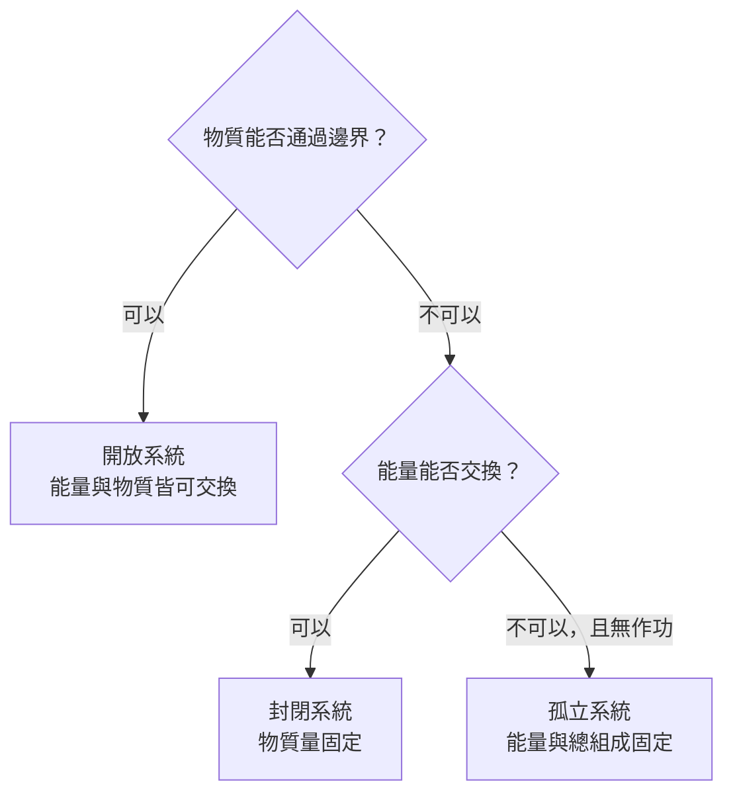
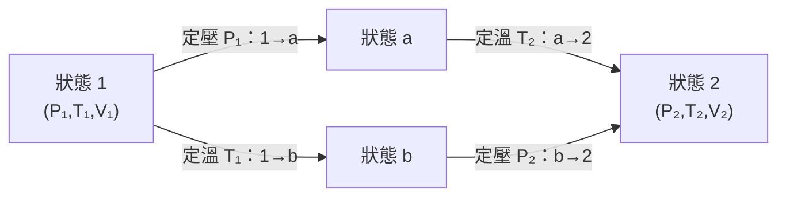
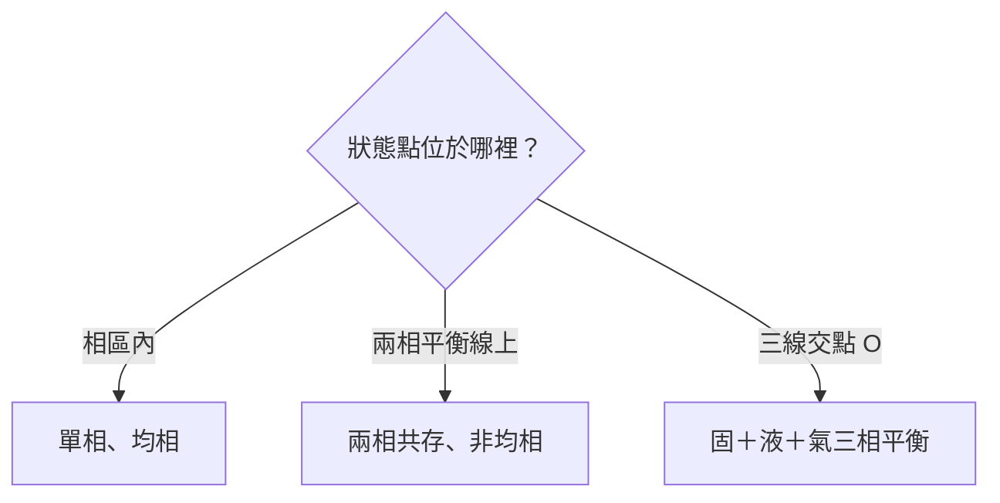

<!-- title: Thermodynamics of Materials -->
<!-- description: 材料熱力學115-1筆記-->
<!-- category: Study -->
<!-- tags: Thermodynamics, Materials -->
<!-- published time: 2026/9/17 -->

<!-- max collapse heading: ## -->
<!-- number outline: false -->
<!-- dim sources: true -->

# Chapter 1｜Introduction and Definition of Terms
## 一、系統、環境與邊界
### 1.1 基本定義

- **熱力學 (thermodynamics)**：研究能量與功之關係，以及受研究系統的平衡狀態與變數。
- **熱／熱能傳遞 (heat / thermal-energy transfer)**：能量沿溫度梯度由一區域傳至另一區域的過程；本書主要用 *thermal energy* 表示這種能量傳遞。
- **系統 (system)**：宇宙中欲詳細研究的部分。
- **環境 (surroundings / environment)**：系統以外、可能與系統交換能量或物質的部分。
- **邊界／壁 (boundary / wall)**：系統與環境之間、決定可發生何種交互作用的界面。
- **簡單熱力學系統 (simple thermodynamic system)**：環境只以壓力與溫度變化和系統交互作用，且系統組成維持不變。

[§1.1 / 書 p.3 / PDF p.1]

### 1.2 三類系統比較

| 系統 | 能量交換 | 物質交換 | 系統能量／組成 | 邊界特徵 | 出處 |
|---|---:|---:|---|---|---|
| 孤立系統 (isolated) | 否；也不對外或受外界作功 | 否 | 能量與總組成皆不變 | 不允許能量、物質通過 | [§1.1 / 書 p.3 / PDF p.1] |
| 封閉系統 (closed) | 是 | 否 | 物質量固定，能量可改變 | 可透熱、不可透物質 | [§1.1 / 書 p.3–4 / PDF p.1–2] |
| 開放系統 (open) | 是 | 是 | 能量與組成皆不必固定 | 可透熱、可透物質 | [§1.1 / 書 p.4 / PDF p.2] |

此判斷圖依課本對 isolated、closed、open systems 的定義整理。[§1.1 / 書 p.3–4 / PDF p.1–2]

### 1.3 邊界分類

- **絕熱 (adiabatic)**：熱能不可通過。
- **透熱 (diathermal)**：熱能可以通過。
- **可滲透 (permeable)**：物質可以通過。
- **不可滲透 (impermeable)**：物質不可通過。
- **半透 (semipermeable)**：部分成分可通過，其他成分不可通過。

[§1.1 / 書 p.4 / PDF p.2]

> **判斷順序**：題目先看「物質能否跨越邊界」，再看「能量能否跨越邊界」，即可判定開放／封閉／孤立；「絕熱」只表示不能傳遞熱能，不等同孤立。[§1.1 / 書 p.3–4 / PDF p.1–2]

## 三、熱力學狀態、變數與狀態函數

### 3.1 微觀狀態與巨觀狀態

- **微觀狀態 (microscopic state)**：若知道系統所有粒子的質量、速度、位置及所有運動模式，原則上可決定全部可測熱力學變數；巨觀系統會涉及超過 $10^{24}$ 個座標，實際上不可行。
- **巨觀狀態 (macroscopic state)**：由可測的熱力學變數描述；所有熱力學變數固定時，巨觀狀態固定，系統稱為處於平衡。

[§1.2 / 書 p.4–5 / PDF p.2–3]

### 3.2 Duhem postulate 與變數數目

- 對「一定量、固定組成的簡單系統」，固定兩個熱力學變數，便會固定其餘熱力學變數；因此只有兩個獨立熱力學變數。[§1.2 / 書 p.5 / PDF p.3]
- 有溫度、壓力以外的熱力學場（如電場或磁場）時，可能需要更多獨立變數。[§1.2 / 書 p.5 / PDF p.3]
- 對 1 mol 純氣體，可令 $P,T$ 為獨立變數，$V$ 為依變數：

$$
V=V(P,T) \tag{1.1}
$$

[§1.2 / 書 p.5 / PDF p.3]

### 3.3 狀態函數與路徑獨立

- 熱力學變數的值不依賴系統如何到達目前狀態；這類內在於狀態的變數是**狀態函數 (state function)**。
- 依賴歷史的性質稱為**外在性質 (extrinsic properties)**，不是系統的平衡性質，並可能隨時間改變。
- 從狀態 1 到狀態 2，無論沿 $1\to a\to2$ 或 $1\to b\to2$，均有 $\Delta V=V_2-V_1$；路徑上的分段變化不同，但總體積變化相同。

[§1.2 / 書 p.5–7 / PDF p.3–5]

兩條路徑分別寫為：

$$
\Delta V_{1\to2}
=\int_{T_1}^{T_2}\left(\frac{\partial V}{\partial T}\right)_{P_1}dT
+\int_{P_1}^{P_2}\left(\frac{\partial V}{\partial P}\right)_{T_2}dP \tag{1.2}
$$

$$
\Delta V_{1\to2}
=\int_{P_1}^{P_2}\left(\frac{\partial V}{\partial P}\right)_{T_1}dP
+\int_{T_1}^{T_2}\left(\frac{\partial V}{\partial T}\right)_{P_2}dT \tag{1.3}
$$

[§1.2 / 書 p.7 / PDF p.5]

其無窮小形式為體積的全微分：

$$
dV=\left(\frac{\partial V}{\partial P}\right)_T dP
+\left(\frac{\partial V}{\partial T}\right)_P dT \tag{1.4}
$$

因 $V$ 為狀態函數，$dV$ 是正合微分，積分結果只由端點決定。[§1.2 / 書 p.7 / PDF p.5]

兩條路徑的分段過程不同，但皆有 $\Delta V=V_2-V_1$。[§1.2 / 書 p.6–7 / PDF p.4–5]

> **〔待插圖 1〕** 建議插入課本 **Figure 1.1：1 mol 氣體在 $V$–$P$–$T$ 空間中的平衡狀態曲面**，並保留路徑 $1\to a\to2$、$1\to b\to2$。用途：搭配式（1.2）–（1.4）理解「路徑不同、狀態函數總變化相同」。[§1.2 / 書 p.6 / PDF p.4]

### 3.4 等溫壓縮率與熱膨脹係數

$$
\beta_T=-\frac{1}{V}\left(\frac{\partial V}{\partial P}\right)_T,
\qquad [\beta_T]=P^{-1}
$$

$$
\alpha=\frac{1}{V}\left(\frac{\partial V}{\partial T}\right)_P,
\qquad [\alpha]=T^{-1}
$$

[§1.2 / 書 p.7 / PDF p.5]

代回式（1.4）：

$$
dV=\alpha VdT-\beta_TVdP
$$

當 $\alpha$ 與 $\beta_T$ 在所考慮的 $T,P$ 範圍內假設為常數時，此式可直接積分。[§1.2 / 書 p.8 / PDF p.6]

## 四、平衡的活塞—汽缸例子

1 mol 氣體裝在具有可動活塞、壁為透熱的汽缸中。平衡須同時符合：

1. 氣體對活塞的壓力等於活塞對氣體的壓力。
2. 若汽缸壁可透熱，氣體溫度等於環境溫度。

[§1.3 / 書 p.8 / PDF p.6]

### 路徑 $1\to b\to2$

- **$1\to b$：定溫壓縮。** 在 $T_1$ 固定時增加活塞負重，使外壓由 $P_1$ 升至 $P_2$；活塞內移，$V_1\to V_b$，直至內外壓重新相等。此段是活塞對氣體作功。
- **$b\to2$：定壓加熱。** 維持 $P_2$，使環境由 $T_1$ 升至 $T_2$；熱能因溫度梯度進入氣體，氣體膨脹並推動活塞，$V_b\to V_2$。此段是膨脹氣體對活塞作功。
- 因 $V$ 為狀態函數，若改走 $1\to a\to2$，最後體積仍為 $V_2$。

[§1.3 / 書 p.8–9 / PDF p.6–7]

> **〔待插圖 2〕** 建議插入課本 **Figure 1.2：透熱汽缸、可動活塞與負重 $W$**。用途：辨認系統邊界、壓力平衡、熱平衡，以及誰對誰作功。[§1.3 / 書 p.8 / PDF p.6]

## 五、理想氣體狀態方程式

### 5.1 由實驗定律到理想氣體

- **Boyle’s law**：定溫下 $P\propto 1/V$。
- **Charles’ law**：定壓下 $V\propto T$。
- 不同真實氣體遵守兩定律的精確度不同；沸點較低的氣體較接近，且所有氣體在壓力降低時都更接近兩定律。
- **理想／完全氣體 (ideal / perfect gas)**：在所有溫度與壓力下精確遵守 Boyle’s law 與 Charles’ law 的假想氣體。

[§1.4 / 書 p.9、11 / PDF p.7、9]

> **〔待插圖 3〕** 建議插入課本 **Figure 1.3(a)、(b)**：分別為定溫下 $P$–$V$ 曲線與定壓下 $V$–$T$ 直線。用途：直接對照 Boyle’s law 與 Charles’ law 的圖形特徵。[§1.4 / 書 p.10 / PDF p.8]

### 5.2 絕對溫標

對理想氣體，$\alpha=1/273.15$；依體積線性外推，$-273.15^\circ\mathrm C$ 時體積為零，這個溫度界限為絕對零度。理想氣體溫標與攝氏溫標關係為：

$$
T(\text{degrees absolute})=T(\text{degrees Celsius})+273.15
$$

[§1.4 / 書 p.11 / PDF p.9]

### 5.3 狀態方程式與氣體常數

結合 Boyle’s law 與 Charles’ law：

$$
\frac{PV}{T}=\frac{P_0V_0}{T_0}=\text{constant} \tag{1.6}
$$

標準溫度壓力 (STP) 為 $0^\circ\mathrm C$、$1\ \mathrm{atm}$；1 mol 理想氣體在 STP 的體積是 $22.414\ \mathrm L$。因此：

$$
R=0.082057\ \frac{\mathrm{L\cdot atm}}{\mathrm{degree\cdot mole}}
$$

對 1 mol 理想氣體：

$$
PV=RT \tag{1.7}
$$

對 $n$ mol 理想氣體（$V'$ 為總體積）：

$$
PV'=nRT
$$

摩爾體積 $V=V'/n$，故每莫耳形式仍為 $PV=RT$。[§1.4、§1.6 / 書 p.11–13 / PDF p.9–11]

### 5.4 第零定律與熱平衡

【原文意旨】若 A 與 B 達熱平衡，B 與 C 達熱平衡，則 A 與 C 也達熱平衡；三者具有相同的絕對溫度。[§1.4 / 書 p.12 / PDF p.10]

- 溫度是強度性熱力學狀態變數。
- 兩系統溫度梯度為零時達熱平衡；若不為零，能量有由高溫系統傳向低溫系統的趨勢。

[§1.4 / 書 p.12 / PDF p.10]

## 六、能量與功的單位

- 功發生於力使物體移動一段距離；功與能量的量綱皆為「力 × 距離」。
- 因壓力為力／面積，所以「壓力 × 體積」亦具有能量量綱。
- SI 能量單位 joule：1 N 的力使物體移動 1 m 所作的功。

[§1.5 / 書 p.12 / PDF p.10]

$$
1\ \mathrm{atm}=101{,}325\ \mathrm{N\,m^{-2}}
$$

$$
1\ \mathrm{L\cdot atm}=101.325\ \mathrm{N\cdot m}=101.325\ \mathrm J
$$

$$
R=8.3144\ \frac{\mathrm J}{\mathrm{degree\cdot mole}}
$$

[§1.5 / 書 p.12–13 / PDF p.10–11]

## 七、廣延性與強度性變數

| 類別 | 判準 | 本章例子 | 轉換關係 | 出處 |
|---|---|---|---|---|
| 廣延性 (extensive) | 數值依系統大小而變 | 總體積 $V'$、內能 $U$、熵 $S$ | 除以體積、質量或莫耳數後可呈強度性特徵 | [§1.6、§1.8 / 書 p.13、17 / PDF p.11、15] |
| 強度性 (intensive) | 數值不依系統大小而變 | $T$、$P$、比容、摩爾體積 $V$ | $V=V'/n$ | [§1.6 / 書 p.13 / PDF p.11] |

> **常考辨析**：總體積 $V'$ 是廣延性；摩爾體積 $V=V'/n$ 不依系統大小，具有強度性特徵。[§1.6 / 書 p.13 / PDF p.11]

## 八、平衡相圖與熱力學成分

### 8.1 成分、相、均相與非均相

- **成分 (component)**：具有固定組成的化學物種；最簡單例子是化學元素與化學計量化合物。
- 系統依成分數分為一元 (unary)、二元 (binary)、三元 (ternary)、四元 (quaternary) 等。
- **相 (phase)**：物理系統中一個有限體積區域，在其中熱力學變數均勻且連續，不會在區域內由一點移到另一點時發生突變。
- **均相 (homogeneous)**：平衡狀態只有一相；**非均相 (heterogeneous)**：有兩相或更多相共存。
- 氣體是均相的單相溶液；液體與固體可為單相，也可因不同組成區域而成多相。
- 多成分金屬稱合金 (alloy)；可為單相或多相。單相晶體合金中，兩種以上成分隨機分布於單一晶體結構，稱為固溶體 (solid solution)。

[§1.7 / 書 p.13–15 / PDF p.11–13]

### 8.2 一元 $P$–$T$ 相圖（H₂O 示意圖）

- 圖中面區分為 solid、liquid、vapor；落在區域內代表單相均相狀態。
- 落在線上代表兩相平衡：AO 為固–液；CO 為固–氣；OB 為液–氣。
- CO 可解讀為固態冰的飽和蒸氣壓隨溫度之變化，或水蒸氣昇華溫度隨壓力之變化；OB 可解讀為液態水的飽和蒸氣壓隨溫度之變化，或露點隨壓力之變化。
- 三條兩相平衡線交於三相點 O；只有此唯一 $P,T$ 組合可維持固＋液＋氣三相平衡。
- 沿 1 atm 等壓路徑 amb 加熱：在 m 發生熔化，m 是正常熔點；在 b 發生沸騰，b 是正常沸點。

[§1.7 / 書 p.14–15 / PDF p.12–13]

此判讀圖對應課本 H₂O 一元 $P$–$T$ 相圖。[§1.7 / 書 p.14–15 / PDF p.12–13]

> **〔待插圖 4〕** 建議插入課本 **Figure 1.4：H₂O 的壓力–溫度平衡相圖**，保留 AO、CO、OB、三相點 O 與 1 atm 路徑 amb。用途：練習單相區、兩相線、三相點、正常熔點與正常沸點的判讀。[§1.7 / 書 p.14 / PDF p.12]

### 8.3 二元溫度–組成相圖（Al₂O₃–Cr₂O₃）

- 完整二元相圖需要組成、溫度、壓力三軸；凝聚相通常取 1 atm 定壓截面，化為溫度–組成二維圖。[§1.7 / 書 p.15 / PDF p.13]
- Al₂O₃ 與 Cr₂O₃ 在 Al₂O₃ 熔點 $2050^\circ\mathrm C$ 以下可形成全範圍固溶體；在 Cr₂O₃ 熔點 $2265^\circ\mathrm C$ 以上可形成全範圍液溶體。[§1.7 / 書 p.15–16 / PDF p.13–14]
- 固相區與液相區之間為固、液兩相平衡區。在 $T_1$，整體組成介於 X 與 Y 時，液相組成為 $l$、固相組成為 $s$。[§1.7 / 書 p.15–16 / PDF p.13–14]
- 對整體組成 C，槓桿定則給出：

$$
f_{\text{solid}}=\frac{lC}{lS},
\qquad
f_{\text{liquid}}=\frac{CS}{lS}
$$

其中各項為相圖上對應線段長度。[§1.7 / 書 p.16 / PDF p.14]

- 成分的選擇具有一定任意性；在 Al₂O₃–Cr₂O₃ 系中最直接選 Al₂O₃ 與 Cr₂O₃，但其他氧化物系統的便利選擇未必如此明顯。[§1.7 / 書 p.16 / PDF p.14]

> **〔待插圖 5〕** 建議插入課本 **Figure 1.5：Al₂O₃–Cr₂O₃ 在 1 atm 的溫度–組成相圖**，保留 $T_1$ tie line、X、Y、$l$、C、$s$。用途：讀取兩相組成並配合槓桿定則計算固、液相分率。[§1.7 / 書 p.15 / PDF p.13]

## 九、熱力學四定律

| 定律 | 核心內容 | 引入／界定的變數 | 性質 | 出處 |
|---|---|---|---|---|
| 第零定律 | 若 A–B、B–C 各自熱平衡，則 A–C 熱平衡 | 溫度 $T$ | 強度性 | [§1.4、§1.8 / 書 p.12、16 / PDF p.10、14] |
| 第一定律 | 宇宙能量守恆；各種能量可互相轉換 | 內能 $U$ | 廣延性狀態函數 | [§1.8.1 / 書 p.17 / PDF p.15] |
| 第二定律 | 在考慮系統、環境及相關限制下，可預測自發過程的演變方向；宇宙熵不減少 | 熵 $S$ | 廣延性狀態函數 | [§1.8.2 / 書 p.17 / PDF p.15] |
| 第三定律 | 完全內部平衡的系統趨近絕對零度時，其熵的所有面向趨近零；另一表述為系統永遠不能到達絕對零度 | 熵 $S$ | 不可達原理 | [§1.8.3 / 書 p.17 / PDF p.15] |

## 十、核心公式總表

<!-- table: scroll -->
| 編號／名稱 | 公式 | 符號與單位 | 前提／適用範圍 | 出處 |
|---|---|---|---|---|
| (1.1) | $V=V(P,T)$ | $V$：1 mol 氣體體積；$P$：壓力；$T$：溫度 | 一定量、固定組成的簡單系統，以 $P,T$ 為獨立變數 | [§1.2 / 書 p.5 / PDF p.3] |
| (1.4) | $dV=(\partial V/\partial P)_T dP+(\partial V/\partial T)_P dT$ | 下標表示固定的變數 | $V$ 為狀態函數；正合微分 | [§1.2 / 書 p.7 / PDF p.5] |
| 等溫壓縮率 | $\beta_T=-V^{-1}(\partial V/\partial P)_T$ | $[\beta_T]=P^{-1}$ | 定溫偏微分 | [§1.2 / 書 p.7 / PDF p.5] |
| (1.5)／熱膨脹係數 | $\alpha=V^{-1}(\partial V/\partial T)_P$ | $[\alpha]=T^{-1}$ | 定壓偏微分 | [§1.2、§1.4 / 書 p.7、11 / PDF p.5、9] |
| 體積全微分 | $dV=\alpha VdT-\beta_TVdP$ | 同上 | 由定義代入 (1.4)；若積分並視係數為常數，須限於指定 $P,T$ 範圍 | [§1.2 / 書 p.8 / PDF p.6] |
| 絕對溫標 | $T_{abs}=T_{^\circ C}+273.15$ | 絕對溫度、攝氏溫度 | 理想氣體溫標 | [§1.4 / 書 p.11 / PDF p.9] |
| (1.6) | $PV/T=P_0V_0/T_0=\text{constant}$ | $P_0=1\ \mathrm{atm}$；$T_0=273.15$ 絕對度 | 1 mol 理想氣體 | [§1.4 / 書 p.11 / PDF p.9] |
| (1.7) | $PV=RT$ | $R=0.082057\ \mathrm{L\,atm\,degree^{-1}\,mol^{-1}}=8.3144\ \mathrm{J\,degree^{-1}\,mol^{-1}}$ | 1 mol 理想氣體 | [§1.4–1.5 / 書 p.12–13 / PDF p.10–11] |
| $n$ mol 理想氣體 | $PV'=nRT$ | $V'$：總體積；$n$：莫耳數 | 理想氣體 | [§1.6 / 書 p.13 / PDF p.11] |
| 槓桿定則 | $f_s=lC/lS$；$f_l=CS/lS$ | 線段取自 tie line | $T_1$ 下、整體組成 C 位於 X–Y 兩相區 | [§1.7 / 書 p.16 / PDF p.14] |
| 位能變化 | $\Delta PE=mg\Delta h$ | $m$：質量；$g$：重力加速度；$\Delta h$：高度變化 | Quantitative Problem 2 | [§1.12 / 書 p.21 / PDF p.19] |

## 十一、代表例題與解題骨架

### 例 1｜$n$ mol 對 $V$–$P$–$T$ 曲面的影響

**題意**：圖 1.1 是 1 mol 理想氣體的曲面；改為 2 mol 或 $n$ mol 時如何改變？[§1.11 / 書 p.19 / PDF p.17]

**判斷**：由 $PV'=nRT$，固定 $P,T$ 時，總體積與 $n$ 成正比。[§1.6、§1.11 / 書 p.13、19 / PDF p.11、17]

**結果**：2 mol 時每一 $P,T$ 點的體積加倍；$n$ mol 時變成 $nV_i$。曲面向較大體積方向移動，課本指出對應位置的斜率與曲率維持相同。[§1.11 / 書 p.19 / PDF p.17]

### 例 2｜求理想氣體的 $\beta_T$ 與 $\alpha$

由 $V=RT/P$：[§1.11 / 書 p.19 / PDF p.17]

$$
\left(\frac{\partial V}{\partial P}\right)_T=-\frac{RT}{P^2}
$$

$$
\beta_T=-\frac1V\left(-\frac{RT}{P^2}\right)=\frac1P
$$

以及

$$
\left(\frac{\partial V}{\partial T}\right)_P=\frac RP
$$

$$
\alpha=\frac1V\frac RP=\frac1T
$$

**結果必記**：理想氣體 $\boxed{\beta_T=1/P}$、$\boxed{\alpha=1/T}$。[§1.11 / 書 p.19 / PDF p.17]

### 例 3｜定體積下的 $P$–$T$ 圖

對 1 mol 理想氣體：

$$
P=\frac{RT}{V}
$$

故每個固定體積對應一條通過原點的直線，斜率為 $R/V$；體積越小，斜率越大。課本以 $V=11.2,22.4,44.8\ \mathrm L$ 計算 $300$–$1300\ \mathrm K$ 的壓力。[§1.12 / 書 p.20 / PDF p.18]

抽查值：$T=300\ \mathrm K$ 時，三者壓力依序為 $2.20,1.10,0.55\ \mathrm{atm}$；$T=1200\ \mathrm K$ 時為 $8.79,4.40,2.20\ \mathrm{atm}$。[§1.12 / 書 p.20 / PDF p.18]

> **〔待插圖 6〕** 建議插入課本 **Figure 1.6：1 mol 理想氣體在三個定體積下的 $P$–$T$ 圖**。用途：比較直線斜率 $R/V$，確認體積越小，斜率越大。[§1.12 / 書 p.20 / PDF p.18]

### 例 4｜落石位能變化

10 lb 岩石下降 100 ft：$m=4.536\ \mathrm{kg}$、$\Delta h=-30.48\ \mathrm m$。[§1.12 / 書 p.21 / PDF p.19]

$$
\Delta PE=mg\Delta h
=(4.536)(9.81)(-30.48)
=-1356\ \mathrm J
$$

負號表示末態位能低於初態。[§1.12 / 書 p.21 / PDF p.19]

## 十二、章末習題對照與作答方向

| 題號 | 題型 | 應用內容 | 作答骨架 | 出處 |
|---|---|---|---|---|
| 1.1 | $V(P,T)$ 曲面二階偏導與曲率正負 | 理想氣體式、偏微分 | 先寫 $V=RT/P$，分別對題目指定變數做二次偏微分，再由式子符號說明曲率 | [Problems / 書 p.21 / PDF p.19] |
| 1.2 | 由 $dV$ 積分導出理想氣體狀態方程式 | (1.4)、$\beta_T=1/P$、$\alpha=1/T$ | 代入得 $dV/V=dT/T-dP/P$，再積分整理 | [Problems / 書 p.21 / PDF p.19；§1.11 / 書 p.19 / PDF p.17] |
| 1.3 | 為何 $P$–$T$ 圖兩相為線，而 $T$–組成圖兩相為區 | 圖 1.4、圖 1.5 | 比較兩圖座標與兩相平衡時可變的整體組成 | [Problems / 書 p.21 / PDF p.19；§1.7 / 書 p.14–16 / PDF p.12–14] |
| 1.4 | 求理想氣體 $\alpha/\beta_T$ | 例 2 結果與 $PV=RT$ | $\alpha/\beta_T=(1/T)/(1/P)=P/T$，再用 $P/T=R/V$ | [Problems / 書 p.21 / PDF p.19；§1.11 / 書 p.19 / PDF p.17] |

## 十三、易錯點與考前自我檢查

1. **heat 在本章是傳遞過程，不是系統內「存有」的量**；本書主要稱 thermal-energy transfer。[§1.1 / 書 p.3 / PDF p.1]
2. **絕熱系統不必然是孤立系統**：絕熱只禁止熱能通過；孤立系統還不能交換物質，也不對外或受外界作功。[§1.1 / 書 p.3–4 / PDF p.1–2]
3. **兩個獨立變數的結論有前提**：一定量、固定組成的簡單系統；存在電場、磁場等額外場時可能需要更多變數。[§1.2 / 書 p.5 / PDF p.3]
4. **路徑獨立的是狀態函數的總變化**；不同路徑上的分段變化與過程仍不同。[§1.2–1.3 / 書 p.6–9 / PDF p.4–7]
5. $\beta_T$ 定義前有負號；對氣體，定溫升壓會使體積下降，因此 $(\partial V/\partial P)_T<0$，使 $\beta_T$ 為正。[§1.2 / 書 p.7 / PDF p.5]
6. $PV=RT$ 是 **1 mol** 形式；$PV'=nRT$ 才是 $n$ mol、總體積形式。[§1.4、§1.6 / 書 p.12–13 / PDF p.10–11]
7. $R$ 的數值須與壓力、體積、能量單位一致；$1\ \mathrm{L\,atm}=101.325\ \mathrm J$。[§1.5 / 書 p.12–13 / PDF p.10–11]
8. 相圖**區域**代表單相（在一元 $P$–$T$ 圖中），**曲線**代表兩相平衡，三線交點代表三相平衡。[§1.7 / 書 p.14–15 / PDF p.12–13]
9. 槓桿定則中某相的分率使用「對側線段」；固相分率為 $lC/lS$，液相分率為 $CS/lS$。[§1.7 / 書 p.16 / PDF p.14]
10. 第二定律的簡述是「宇宙熵不減少」，不能未區分系統與環境便直接說任一系統的熵永遠增加。[§1.8.2 / 書 p.17 / PDF p.15]

## 十四、一頁式考前速記

- **分類系統**：isolated＝能量、物質皆不交換；closed＝能量可、物質不可；open＝兩者皆可。[§1.1 / 書 p.3–4 / PDF p.1–2]
- **簡單固定組成系統**：兩個獨立變數決定平衡狀態；常選 $P,T$，其餘為依變數。[§1.2 / 書 p.5 / PDF p.3]
- **狀態函數**：只看初末態，微分為正合；$V=V(P,T)$。[§1.2 / 書 p.5–7 / PDF p.3–5]
- **全微分**：$dV=(\partial V/\partial P)_T dP+(\partial V/\partial T)_P dT=\alpha VdT-\beta_TVdP$。[§1.2 / 書 p.7–8 / PDF p.5–6]
- **理想氣體**：$PV=RT$（1 mol）、$PV'=nRT$；$\beta_T=1/P$、$\alpha=1/T$。[§1.4、§1.6、§1.11 / 書 p.12–13、19 / PDF p.10–11、17]
- **能量單位**：$1\ \mathrm{L\,atm}=101.325\ \mathrm J$；$R=8.3144\ \mathrm{J\,degree^{-1}\,mol^{-1}}$。[§1.5 / 書 p.12–13 / PDF p.10–11]
- **變數分類**：總量隨系統大小變＝廣延性；$T,P$ 與每單位量的性質＝強度性。[§1.6 / 書 p.13 / PDF p.11]
- **相圖**：區內單相、線上兩相、三相點三相；二元兩相區用 tie line 找相組成、槓桿定則找相分率。[§1.7 / 書 p.14–16 / PDF p.12–14]
- **四定律**：第零＝熱平衡與 $T$；第一＝能量守恆與 $U$；第二＝自發方向與 $S_{universe}$ 不減；第三＝完全內平衡下 $T\to0$ 時 $S\to0$／絕對零度不可達。[§1.4、§1.8 / 書 p.12、16–17 / PDF p.10、14–15]

## 十五、未載明與疑義清單

- 【未載明】本章只概述第一、第二、第三定律，未提供完整數學式、推導與各定律的詳細適用限制；課本說明將於後續章節討論。[§1.8 / 書 p.16–17 / PDF p.14–15]
- 【未載明】本章對「相」使用暫定定義，並註明更精確定義在第 15 章導論。[§1.7 / 書 p.14 / PDF p.12]
- 【疑義】書 p.7 在 $\Delta V_{b\to2}$ 的中間式印為 $\int(\partial V/\partial P)_{P_2}dT$，但同頁後續式（1.3）與全微分式（1.4）均使用 $\int(\partial V/\partial T)_{P_2}dT$；本筆記依課本式（1.3）保留後者，未擅自改寫原頁的矛盾。[§1.2 / 書 p.7 / PDF p.5]
- 【疑義】書 p.21 對牛頓的單位列為 $1\ \mathrm N=1\ \mathrm{kg\,m\,s^{-1}}$，但同頁位能計算寫為 $\mathrm{kg\,m^2\,s^{-2}}$ 並換算為 J；兩處量綱呈現不一致，本筆記只保留課本的數值結果 $-1356\ \mathrm J$。[§1.12 / 書 p.21 / PDF p.19]